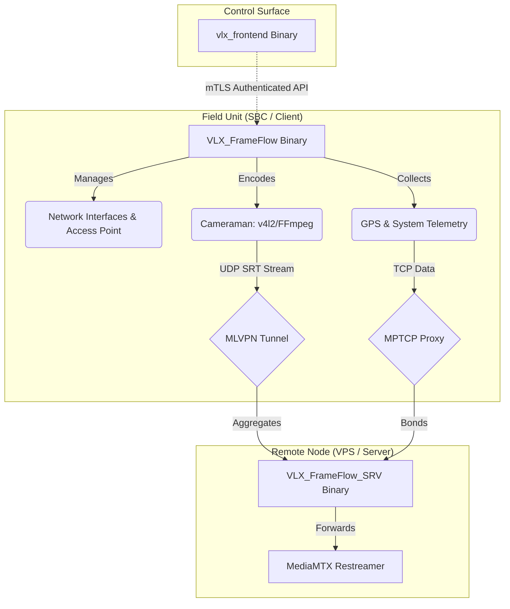

# Architecture

The VLX FrameFlow suite operates via a robust, multi-binary architecture designed specifically to segment the distinct responsibilities required of field edge devices (SBCs) and remote relay nodes (VPS).

This document serves as a deep dive into the system's design, operational flow, security implementation, and execution context.

## System Overview



## Binary Components

The project has been refactored from a monolithic bash structure into a compiled Go multi-binary ecosystem:

1. **`VLX_FrameFlow` (The Client):** Exclusively deployed on Single Board Computers (like Orange Pi 5 Plus or Radxa Rock 5T). Responsible for hardware interactions: capturing video via v4l2, managing hostapd/networkd, and gathering GPS data. It serves the mTLS-protected API.
2. **`VLX_FrameFlow_SRV` (The Server):** Exclusively deployed on a Virtual Private Server (VPS). Lightweight, focusing strictly on relaying traffic, receiving bonded connections, and enforcing UFW firewall rules.
3. **`vlx_frontend` (The UI):** A standalone web server encapsulating a pre-built Svelte SPA (`//go:embed`). Designed to run remotely on an operator's machine or in the cloud to manage the Field Unit via secure APIs. The frontend utilizes parallel REST polling (`Promise.all`) to dynamically fetch backend state, features a semantic parser for translating systemd string statuses (e.g., 'active', 'inactive', 'failed'), organizes UI components via CSS Grid layout, and streams text console output utilizing an `ansi-to-html` converter for colorized logs.

## API Framework & Routing

The core API has transitioned to utilizing the highly performant `Gin` framework (`github.com/gin-gonic/gin`). HTTP routes are registered using native Gin handler signatures (`func(c *gin.Context)`) rather than wrapping standard `http.HandlerFunc` components. Global CORS middleware handles OPTIONS requests automatically.

### Operational Endpoints

The unprivileged user interacts with the backend components via a standardized REST API structured primarily as `/api/<module>/{start,stop,status,reset}`. Key operational endpoints include:

- **`/api/frameflow/client/reset`**: Initiates a full reset of client networking and bonding.
- **`/api/gps/start` \| `stop` \| `status`**: Manages the transient systemd user unit for the GPS telemetry process.
- **`/api/mediamtx/start` \| `stop` \| `status`**: Controls the local MediaMTX static user service.
- **`/api/cameraman/start` \| `stop` \| `status`**: Orchestrates FFmpeg encoding pipelines directly to the MediaMTX API.
- **`/api/frameflow/ap/start` \| `stop` \| `status`**: Triggers internal privilege escalation to manipulate `hostapd` and network interfaces.

## Unified Configuration Paradigm

All Go daemons (`bonding.go`, `mediamtx.go`, etc.) across the suite expect a standardized configuration filename. To prevent logic fragmentation between the Client and Server roles, the `install.go` logic safely maps divergent templates (`frameflow.settings.template` and `frameflow_srv.settings.template`) into a single universally named `/opt/VLX_FrameFlow/etc/frameflow.settings` file during installation.

## Network Bonding Architecture

Ensuring uninterrupted, high-bandwidth streaming from the field requires resilient network bonding. The suite achieves this through a dual-protocol aggregation strategy:

*   **UDP Traffic (Streaming):** Handled exclusively by **MLVPN**. MLVPN creates multiple concurrent tunnels over available physical interfaces (e.g., Ethernet + multiple Cellular Modems) to aggregate bandwidth for the UDP-based SRT video streams.
*   **TCP Traffic (Telemetry/API - Native Dual-Stack TCP Bonding):** Handled by **MPTCP** (MultiPath TCP) acting alongside `shadowsocks-libev` and `v2ray-plugin`. The Go parser dynamically converts comma-separated IPs into a JSON array for `shadowsocks-libev`. This allows mobile backpacks (which often favor IPv6 carrier routing) to establish concurrent IPv4 and IPv6 tunnels to the Server simultaneously, empowering the MPTCP kernel module to dynamically balance packets over the lowest-latency path.

### Seamless Fallback Pipeline (Zero-Drop)

The Server's MediaMTX instance maintains a continuous background loop (`/offline`) using `ffmpeg -stream_loop`. When the Client backpack loses 4G connectivity, MediaMTX natively switches the `/zainetto` path to the `/offline` fallback without terminating the TCP/UDP connection to downstream consumers (like VisionBridge or OBS). This prevents stream buffering or crashing on the final Twitch output.

To prevent rapid stream flapping during minor cellular jitters, the Client employs a **State Latch** on the MLVPN tunnel utilizing a **Network Hysteresis** logic. The Client continuously attempts to ping the Server tunnel (`10.1.10.1`). Instead of a binary success/fail check, the system performs a retry loop (up to 3 consecutive ping attempts with a small delay). It will only drop the bonded UDP route and fallback to a standard unbonded route if the tunnel explicitly stays down and all 3 ping checks fail.

Furthermore, to ensure application stability before initializing the FFmpeg encoder pipeline, the core implements **Strict URL Validation** on streaming endpoints such as `SRT` using Go's native `net/url` parser. The ingest will gracefully reject malformed URLs prior to execution.

## Security & Execution Flow

### Zero-Trust mTLS

To secure the connection between the remote `vlx_frontend` and the SBC's `VLX_FrameFlow` API, the system implements Mutual TLS (mTLS):
1.  On first run, the Client generates a local Certificate Authority (CA) in `/opt/VLX_FrameFlow/certs/`.
2.  The Client provisions a signed `.p12` or `.pem` Client Certificate for authorized remote UI instances.
3.  The core API uses `tls.RequireAndVerifyClientCert`, refusing any connection not signed by the local CA.

### "Build as User, Run as Root"

The suite enforces a strict dichotomy between Client and Server roles regarding execution privilege and systemd architecture:

1.  **Build:** Unprivileged compilation via `build.sh`.
2.  **Install:** Executing the compiled binary as root triggers `internal/sysutils.InstallBinary()`.
3.  **Deploy:** The binaries place themselves into `/opt/VLX_FrameFlow/bin/` and configure templates in `/opt/VLX_FrameFlow/etc/`.
4.  **Run (CLIENT):** On the SBC/Field Unit, background services must strictly execute as the dedicated, unprivileged `$FRAMEFLOW_USER`. Systemd management uses User-Space Systemd (`systemctl --user`). Unit files are generated in `~/.config/systemd/user/` and explicitly target `default.target`. **Important:** Systemd Lingering (`loginctl enable-linger`) must be enabled by root during initial setup to allow background execution without an active SSH session. All Client CLI modules implement strict runtime constraints preventing root execution (`if os.Geteuid() == 0`).
5.  **Run (SERVER):** On the VPS/Relay Node, the main daemon strictly requires `root` execution (UID 0) to orchestrate routing and UFW firewall rules. Systemd management uses System-Space Systemd (`/etc/systemd/system/`) and targets `multi-user.target`. To maintain security, the server relies on **Privilege Dropping** (`User=`, `Group=`) inside the unit templates for specific exposed services (like MediaMTX) to minimize the blast radius. ALL Server orchestrator CLI modules enforce a root guard requiring root execution (`if os.Geteuid() != 0`).

### AP Module Privilege Escalation Pattern

The Access Point (AP) module within the Client architecture necessitates modifying system-level network configurations (`hostapd`, `systemd-networkd`, `systemd-resolved`) which requires root access. However, the Client CLI operates as an unprivileged user.

To bridge this gap securely, the suite implements a strict internal privilege escalation pattern:
- Unprivileged CLI commands wrap themselves in `sudo` to call hidden internal operations (e.g., `_ap_system_ops`).
- These hidden operations are protected by absolute root guards (`if os.Geteuid() != 0 { log.Fatal(...) }`).
- Once inside the root context, functions executing system commands (like restarting services via `sysutils.RunCommand`) do not redundantly include `sudo`.


### Server API Command Forwarding

To facilitate communication between companion applications (such as ChatBridge) running on the Server/VPS and the remote Client (SBC), the Server implements a local HTTP API relay (`handlers.go` Transparent Proxy logic).

- The `VLX_FrameFlow_SRV api start` command spins up a local API relay server (binding to `<bind_address>:<bind_port>`, defaulting to `127.0.0.1:9090`). If server certificates are provided, it natively serves over HTTPS; otherwise, it falls back to plain HTTP.
- Requests sent to the `/api/v1/relay/*path` endpoint are captured.
- The Server reconstructs the request (seamlessly passing JSON bodies, query parameters, and headers) and forwards it directly to the native Client API over the secure MLVPN tunnel (`https://<relay_client_host>:<relay_client_port>/api<path>`, defaulting to `https://10.1.10.2:9090`).
- It bypasses standard TLS verification (`InsecureSkipVerify: true`) for this specific internal tunnel communication. This is safe because the MLVPN tunnel (`10.1.10.x`) itself is strongly encrypted and isolated from the public internet, and the remote Client generates its own self-signed local TLS certificates.
- The transparent proxy ensures the local companion app receives the exact HTTP response (status codes and body) generated by the Client.
- The `RegisterRoutes` function strictly separates duties using an `isServer` flag: the Server exposes *only* the relay (`/api/v1/relay/*path`), while the Client exposes *only* the local command handlers (`/api/...`).

### Separation of Duties (Bonding vs Routing)

The dual-protocol nature ensures network reliability without cross-contamination:
- **Shadowsocks (via MPTCP):** Handles all bonded outbound TCP internet traffic. This is used by the Client to reach the broader internet transparently via the proxy.
- **MLVPN (UDP):** Handles the high-bandwidth SRT streams and the secure, bidirectional internal telemetry and API command routing between the Server (`10.1.10.1`) and Client (`10.1.10.2`).

## Module-Specific Behaviors

The system implements several highly specific optimizations and fail-safes per module:

### Cameraman
- **Strict URL Parsing:** Incorporates robust `net/url` parsing logic to validate SRT stream IDs.
- **Fallback Format Selection:** Employs a linear absolute-difference algorithm against user-defined maximums (`CAM_MAX_RESOLUTION`, `CAM_MAX_FPS`) to intelligently select fallback video formats (preferring H.264 copy, then MJPEG, then YUYV) when exact formats are unavailable.
- **SQLite Concurrency:** The backend SQLite database (`modernc.org/sqlite`) is configured with `_pragma=journal_mode(WAL)` and `_pragma=busy_timeout(5000)` in its DSN to inherently prevent 'database is locked' boot race conditions during concurrent module initialization.

### GPS Telemetry
- **Socket Draining:** Implements a non-blocking TCP socket drain pattern against `gpsd` to prevent TCP buffer desynchronization and data lag typical of high-frequency positioning data.
- **Rate Limiting:** Enforces a strict 5-second rate limit on HTTP POST transmissions to external endpoints.
- **Transient Cleanup:** Actively manages transient systemd units, executing `systemctl --user reset-failed` during cleanup to prevent unit name conflicts.

### MediaMTX & Bonding (v2ray)
- **Dynamic Architecture Resolution:** During initialization and updates, the system dynamically checks `runtime.GOARCH` to resolve and download correct asset architectures. This strictly prevents "Exec format error" failures when deploying across heterogeneous ARM and x86_64 fleets.
- **Static Configuration:** MediaMTX natively operates as a static systemd user service with a statically generated configuration at `$VLXsuite_DIR/etc/mediamtx.settings`.
- **Protocol Configuration:** MediaMTX is strictly configured to enable WebRTC, SRT, RTMP, and the internal API, while explicitly disabling RTSP, HLS, and WebTransport to optimize performance and security.
- **Hook Distinction:** The `wificam` path acts as an RTMP-to-SRT auto-forwarder using a `runOnReady` hook, whereas the `cameraman` path relies on direct V4L2-to-SRT ingestion utilizing a `runOnInit` hook.

## Filesystem Structure

Following Linux File Hierarchy Standard (FHS) best practices, the global installation path is centralized:

```text
/opt/VLX_FrameFlow/
├── bin/
│   ├── VLX_FrameFlow
│   ├── VLX_FrameFlow_SRV
│   └── vlx_frontend
├── etc/
│   ├── frameflow.settings
│   ├── frontend.settings
│   └── mediamtx.settings
└── certs/
    ├── ca.crt
    └── server.crt
```
