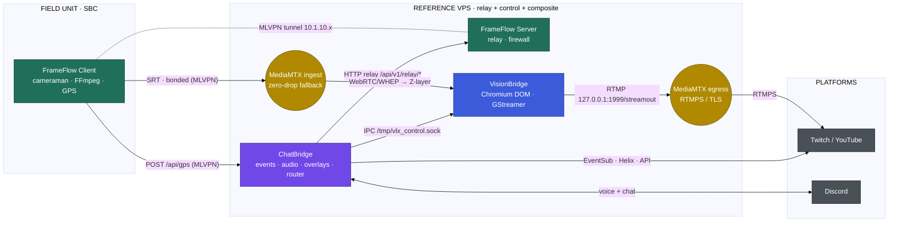

# Architecture — VLX FrameFlow

> **Part of the VLX Stream Flow ecosystem — Edge Acquisition & Transport tier.**
> This document details FrameFlow's internal design and its contracts with the sibling services **VLX VisionBridge** and **VLX ChatBridge**.

FrameFlow operates as a **multi-binary architecture** that segments the responsibilities of field edge devices (SBCs) and remote relay nodes (VPS). It originates the ecosystem's live A/V feed and telemetry stream.

---

## The VLX Stream Flow ecosystem

VLX Stream Flow is a self-hosted, end-to-end broadcasting stack composed of three cooperating services:

| Project | Tier | Responsibility | |
| :--- | :--- | :--- | :--- |
| **VLX FrameFlow** | Edge & Transport | Bonded uplink (MLVPN + MPTCP), SBC multi-camera SRT encode, GPS telemetry, VPS relay | **← this repository** |
| **VLX VisionBridge** | Composition | Headless Chromium-DOM scene compositor + GStreamer capture → MediaMTX restream | |
| **VLX ChatBridge** | Control & Engagement | Twitch/YouTube events, Discord audio gateway, overlays, and the ecosystem command router | |



### Reference topology

The reference deployment is a **single VPS** that co-hosts the FrameFlow Server, ChatBridge, and VisionBridge (each with its MediaMTX role), reachable from the SBC over the MLVPN tunnel (`10.1.10.x`). Components may be split across hosts; the contracts below are host-agnostic.

---

## VLX Stream Flow contracts

> These four contracts are **normative for the whole ecosystem** and are reproduced verbatim in each project's `ARCHITECTURE.md`. Change them in lockstep across all three repositories.

### Canonical port & endpoint map

| Service | Component | Bind (default) | Purpose |
| :--- | :--- | :--- | :--- |
| FrameFlow | Client API (Gin) | `9090` | `/api/<module>/…` on the SBC |
| FrameFlow | Server relay | `127.0.0.1:9090` | `/api/v1/relay/*`, `/api/v1/peer/:id/*` |
| FrameFlow | Frontend (Svelte) | `8080` | Control panel + telemetry WS `/ws` |
| FrameFlow | MediaMTX ingest | SRT `8890` · RTMP `1935` · RTMPS `1936` · WebRTC `8889` · API `127.0.0.1:9997` | `cameraman` / `wificam` paths |
| FrameFlow | gpsd | `1198` | local GPS daemon |
| ChatBridge | Server (overlays + GPS ingest) | `8000` (test `8001`) | overlays, `POST /api/gps` |
| ChatBridge | Control API | `127.0.0.1:8760` | management REST + console WS |
| ChatBridge | Frontend (Svelte) | `8090` | GUI → control API |
| ChatBridge | Connector | `/tmp/vlx_control.sock` | IPC **writer** → VisionBridge |
| VisionBridge | Control API | `127.0.0.1:8770` | management REST + console WS |
| VisionBridge | Frontend (Svelte) | `8091` | GUI → control API |
| VisionBridge | Overlay/WS server | `50051` (WebRTC `50000–50050`) | Chromium DOM sync |
| VisionBridge | Connector | `/tmp/vlx_control.sock` | IPC **listener** ← ChatBridge |
| VisionBridge | MediaMTX egress | RTMP `1999` · RTMPS `1936` · SRT `8890` | `streamout` restream |

> ⚠️ **Co-location deconfliction:** on the single-VPS reference topology the FrameFlow ingest MediaMTX and the VisionBridge egress MediaMTX **both** default to RTMPS `1936` and SRT `8890`. Assign distinct ports per instance (e.g. move VisionBridge's MediaMTX RTMPS to `1937` / SRT to `8891`) before running them on the same host.

### 1. Connector (IPC) contract — ChatBridge → VisionBridge

Transport: **newline-delimited JSON over a Unix domain socket** (`/tmp/vlx_control.sock`). ChatBridge is the writer (`connector.ipc_control_out`); VisionBridge is the listener (`connector.ipc_control_in`). *(There is no ZeroMQ; the legacy token `[ZMQ_CONTROL]` is retained only for backward compatibility in command files.)*

Envelope:

```json
{ "event_id": "uuid", "timestamp": 1700000000, "action": "…", "target": "…", "payload": { "enabled": true, "text": "…" } }
```

| `action` | `target` | `payload` | Effect on VisionBridge |
| :--- | :--- | :--- | :--- |
| `set_input_state` | `stream` | `{enabled}` | Enable/disable output; disabling SIGKILLs FFmpeg. |
| `set_input_state` | `overlay@layerN` | `{enabled, text=path}` | Toggle Z-layer *N*; set its path when enabling. |
| `set_input_state` | `volume@layerN` | `{text="0..100"}` | Set Z-layer *N* volume (live, no restart). |
| `reload` | `chromium` | `{}` | Restart the Chromium DOM engine. |
| `apply_template` | — | `{text=template_filename}` | Apply a stored Z-layout template. |

**Known limitation (see incongruousness log):** ChatBridge's `[ZMQ_CONTROL]`/`ipc_control` parser only forwards the `text`/`path` field for `set_input_state`; `apply_template` cannot yet carry its template name from ChatBridge, and pass-through events emitted as `trigger_event` are not recognised by VisionBridge. Drive `apply_template` over the socket directly until the parser is extended.

### 2. Command / webhook contract — ChatBridge → FrameFlow

ChatBridge reaches the SBC through the FrameFlow **Server relay**, never the SBC API directly:

```
POST http://127.0.0.1:9090/api/v1/relay/<path>      →  MLVPN  →  SBC /api/<path>
```

Valid `<path>` verbs (Client API): `frameflow/client/{start,stop,status,reset}`, `frameflow/ap/{start,stop,status}`, `frameflow/bonding/{start,stop,status}`, `cameraman/{start,stop,status,list-dev}`, `mediamtx/{start,stop,status}`, `gps/{start,stop,status}`. Example: `POST /api/v1/relay/cameraman/start` with `{"device":"V0A1"}`.

### 3. GPS telemetry contract — FrameFlow → ChatBridge

The SBC GPS sender POSTs, at ~1 msg / 5 s, to `gps_target_url` (the ChatBridge `POST /api/gps` receiver, typically `http://10.1.10.1:8000/api/gps` over MLVPN). Body:

```json
{ "lat": 0.0, "lon": 0.0, "alt": 0.0, "pos_error": 0.0, "speed": 0.0 }
```

ChatBridge re-wraps this as `{"type": "<overlay.gps.event_type|gps>", "data": {…}}` and broadcasts it over WebSocket to `gps_overlay.html` (which also accepts the legacy type `gps_update`) at 60 fps. The endpoint is unauthenticated by design; Layer-3 MLVPN isolation secures it.

### 4. Media-path contract — FrameFlow → VisionBridge

SBC cameras → FrameFlow Client FFmpeg **SRT (bonded, MLVPN)** → FrameFlow Server **MediaMTX** (`cameraman`/`wificam`, SRT `8890`, zero-drop `/offline` fallback) → VisionBridge consumes the feed as a **Chromium Z-layer** (a WebRTC/WHEP or iframe URL pointing at the ingest MediaMTX) → VisionBridge composites and restreams onward (contract handled inside VisionBridge).

---

## Binary components

1. **`VLX_FrameFlow` (Client)** — SBC-only (e.g. Orange Pi 5 Plus, Radxa Rock 5T). Captures video via V4L2, manages `hostapd`/`networkd`, gathers GPS, and serves the mTLS-protected API.
2. **`VLX_FrameFlow_SRV` (Server)** — VPS-only. Relays traffic, receives bonded connections, enforces UFW rules, and exposes the command relay.
3. **`vlx_frontend` (UI)** — Standalone web server embedding a pre-built Svelte SPA (`//go:embed`). Uses parallel REST polling, semantic systemd-state parsing, CSS-grid layout, and `ansi-to-html` consoles.

## API framework & routing

The API uses **Gin** with native handler signatures and global CORS middleware. `RegisterRoutes` strictly separates duties via an `isServer` flag: the **Server** exposes *only* the relay (`/api/v1/relay/*path`, `/api/v1/peer/:id/*path`); the **Client** exposes *only* local handlers (`/api/frameflow/…`, `/api/cameraman/…`, `/api/mediamtx/…`, `/api/gps/…`, plus `/api/ws/ticket`).

## Configuration paradigm

All Go daemons expect a single universally named `/opt/VLX_FrameFlow/etc/frameflow.settings`. Installation safely maps the divergent role templates (`frameflow.settings.template`, `frameflow_srv.settings.template`) into that one filename, preventing logic fragmentation between roles. The file is **shell-sourced** `KEY="value"` (env-style) — distinct from the YAML settings used by ChatBridge and VisionBridge, because FrameFlow's units source it directly as environment.

## Network bonding architecture

- **UDP (streaming):** handled by **MLVPN**, aggregating multiple physical interfaces (Ethernet + cellular modems) for SRT video.
- **TCP (telemetry/API/internet):** handled by **MPTCP** with `shadowsocks-libev` + `v2ray-plugin`. The Go parser converts comma-separated IPs into a JSON array, enabling concurrent IPv4/IPv6 tunnels so the MPTCP kernel module balances over the lowest-latency path.

### Zero-drop fallback & hysteresis

The Server's MediaMTX maintains a background `ffmpeg -stream_loop` on an `/offline` path; on connectivity loss it swaps the live path to `/offline` without terminating downstream consumers (VisionBridge / OBS), preventing buffering or crashes on the final output. To avoid flapping, the Client applies a **state latch** with **network hysteresis**: it drops the bonded route only after 3 consecutive failed pings to the server tunnel (`10.1.10.1`).

## Security & execution flow

### Zero-trust mTLS

The Client generates a local CA on first run (`/opt/VLX_FrameFlow/certs/`), provisions signed client certificates for authorized remote UI instances, and enforces `tls.RequireAndVerifyClientCert`, rejecting any connection not signed by the local CA.

### "Build as User, Run as Root"

Unprivileged build (`build.sh`) → root install (`internal/sysutils.InstallBinary()`) places binaries in `/opt/VLX_FrameFlow/bin/` and templates in `/opt/VLX_FrameFlow/etc/`. **Client** services run as `$FRAMEFLOW_USER` under user-space systemd (lingering required); all client CLI modules refuse root. **Server** orchestration requires root and drops privileges for exposed services.

### AP privilege-escalation pattern

Unprivileged Client CLI commands wrap themselves in `sudo` to invoke hidden internal ops (e.g. `_ap_system_ops`) guarded by absolute root checks; once in the root context, system commands run without redundant `sudo`.

### Server command forwarding

`VLX_FrameFlow_SRV api start` spins up the relay (`<bind_address>:<bind_port>`, default `127.0.0.1:9090`; HTTPS when server certs exist). Requests to `/api/v1/relay/*path` are reconstructed (body, query, headers) and forwarded to the Client API over MLVPN (`https://<relay_client_host>:<relay_client_port>/api<path>`, default `https://10.1.10.2:9090`), with `InsecureSkipVerify: true` — safe because the MLVPN tunnel is encrypted, isolated, and the Client uses self-signed local certs.

## Module-specific behaviours

- **Cameraman** — strict `net/url` SRT validation; fallback format selection by linear absolute-difference against `CAM_MAX_RESOLUTION`/`CAM_MAX_FPS` (H.264 copy → MJPEG → YUYV); SQLite DSN with `journal_mode(WAL)` + `busy_timeout(5000)` to avoid boot-time lock races.
- **GPS telemetry** — non-blocking `gpsd` socket drain; 5-second POST rate limit; transient-unit cleanup via `systemctl --user reset-failed`.
- **MediaMTX & bonding** — dynamic `runtime.GOARCH` asset resolution; static systemd service with `mediamtx.settings`; WebRTC/SRT/RTMP + internal API enabled, RTSP/HLS/WebTransport disabled; `wificam` uses an RTMP→SRT `runOnReady` forwarder while `cameraman` uses direct V4L2→SRT `runOnInit`.

## Filesystem structure

```text
/opt/VLX_FrameFlow/
├── bin/   ├── VLX_FrameFlow  ├── VLX_FrameFlow_SRV  └── vlx_frontend
├── etc/   ├── frameflow.settings  ├── frontend.settings  └── mediamtx.settings
└── certs/ ├── ca.crt  └── server.crt
```

---

<sub>VLX FrameFlow is part of the **VLX Stream Flow** ecosystem · [FrameFlow](https://github.com/viruslox/VLX_FrameFlow) · [VisionBridge](https://github.com/viruslox/VLX_VisionBridge) · [ChatBridge](https://github.com/viruslox/VLX_ChatBridge)</sub>
