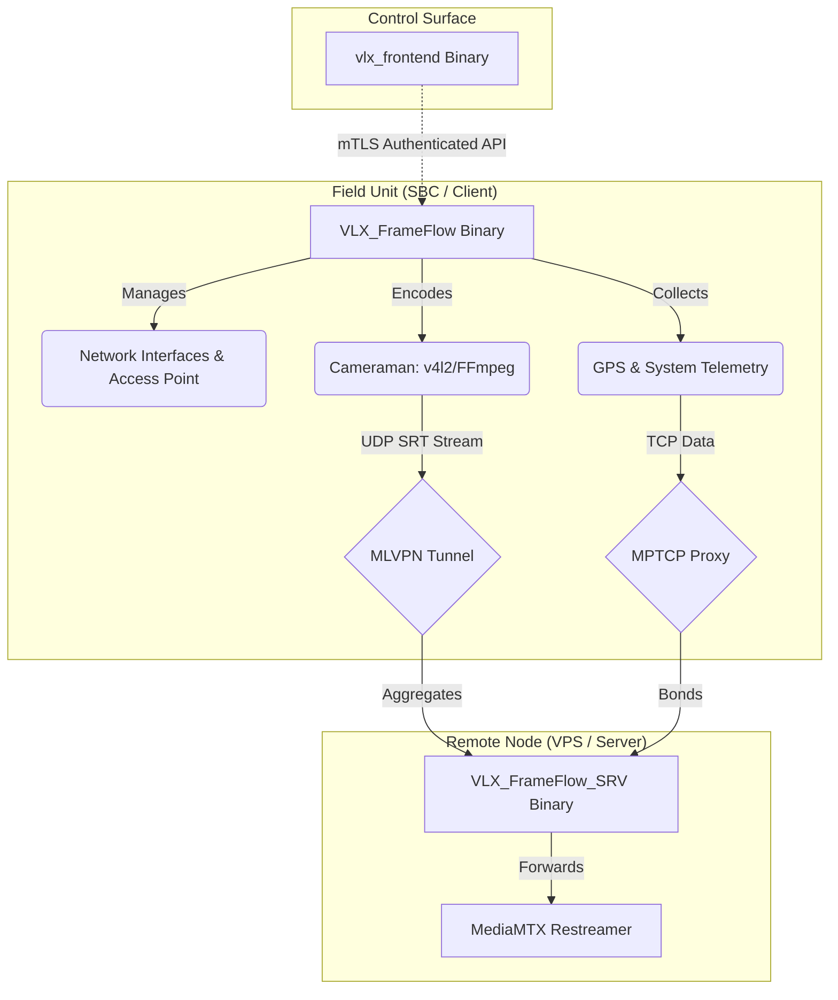

# Architecture

The VLX FrameFlow suite operates via a robust, multi-binary architecture designed specifically to segment the distinct responsibilities required of field edge devices (SBCs) and remote relay nodes (VPS).

This document serves as a deep dive into the system's design, operational flow, security implementation, and execution context.

## System Overview



## Binary Components

The project has been refactored from a monolithic bash structure into a compiled Go multi-binary ecosystem:

1. **`VLX_FrameFlow` (The Client):** Exclusively deployed on Single Board Computers (like Orange Pi 5 Plus or Radxa Rock 5T). Responsible for hardware interactions: capturing video via v4l2, managing hostapd/networkd, and gathering GPS data. It serves the mTLS-protected API.
2. **`VLX_FrameFlow_SRV` (The Server):** Exclusively deployed on a Virtual Private Server (VPS). Lightweight, focusing strictly on relaying traffic, receiving bonded connections, and enforcing UFW firewall rules.
3. **`vlx_frontend` (The UI):** A standalone web server encapsulating a pre-built Svelte SPA (`//go:embed`). Designed to run remotely on an operator's machine or in the cloud to manage the Field Unit via secure APIs.

## Network Bonding Architecture

Ensuring uninterrupted, high-bandwidth streaming from the field requires resilient network bonding. The suite achieves this through a dual-protocol aggregation strategy:

*   **UDP Traffic (Streaming):** Handled exclusively by **MLVPN**. MLVPN creates multiple concurrent tunnels over available physical interfaces (e.g., Ethernet + multiple Cellular Modems) to aggregate bandwidth for the UDP-based SRT video streams.
*   **TCP Traffic (Telemetry/API):** Handled by **MPTCP** (MultiPath TCP) acting alongside `shadowsocks-libev` and `v2ray-plugin`. This ensures API calls and telemetry data transparently utilize multiple paths without requiring application-level awareness.

## Security & Execution Flow

### Zero-Trust mTLS

To secure the connection between the remote `vlx_frontend` and the SBC's `VLX_FrameFlow` API, the system implements Mutual TLS (mTLS):
1.  On first run, the Client generates a local Certificate Authority (CA) in `/opt/VLX_FrameFlow/certs/`.
2.  The Client provisions a signed `.p12` or `.pem` Client Certificate for authorized remote UI instances.
3.  The core API uses `tls.RequireAndVerifyClientCert`, refusing any connection not signed by the local CA.

### "Build as User, Run as Root"

To maintain security and FHS compliance, the suite enforces a strict compilation and deployment workflow:
1.  **Build:** Unprivileged compilation via `build.sh`.
2.  **Install:** Executing the compiled binary as root triggers `internal/sysutils.InstallBinary()`.
3.  **Deploy:** The binaries place themselves into `/opt/VLX_FrameFlow/bin/` and configure templates in `/opt/VLX_FrameFlow/etc/`.
4.  **Run:** Background services execute as the dedicated, unprivileged `$FRAMEFLOW_USER` via `systemd --user` units to limit the blast radius.


### Server API Command Forwarding

To facilitate communication between companion applications (such as ChatBridge) running on the Server/VPS and the remote Client (SBC), the Server implements a local HTTP API relay (`handlers.go` Transparent Proxy logic).

- The `VLX_FrameFlow_SRV api start` command spins up a local HTTP server (defaulting to `127.0.0.1:9090`).
- Requests sent to the `/api/v1/relay/*path` endpoint are captured.
- The Server reconstructs the request (seamlessly passing JSON bodies, query parameters, and headers) and forwards it directly to the native Client API over the secure MLVPN tunnel (`https://10.1.10.2:<CLIENT_PORT>/api<path>`).
- It bypasses standard TLS verification (`InsecureSkipVerify: true`) for this specific internal tunnel communication. This is safe because the MLVPN tunnel (`10.1.10.x`) itself is strongly encrypted and isolated from the public internet, and the remote Client generates its own self-signed local TLS certificates.
- The transparent proxy ensures the local companion app receives the exact HTTP response (status codes and body) generated by the Client.

### Separation of Duties (Bonding vs Routing)

The dual-protocol nature ensures network reliability without cross-contamination:
- **Shadowsocks (via MPTCP):** Handles all bonded outbound TCP internet traffic. This is used by the Client to reach the broader internet transparently via the proxy.
- **MLVPN (UDP):** Handles the high-bandwidth SRT streams and the secure, bidirectional internal telemetry and API command routing between the Server (`10.1.10.1`) and Client (`10.1.10.2`).

## Filesystem Structure

Following Linux File Hierarchy Standard (FHS) best practices, the global installation path is centralized:

```text
/opt/VLX_FrameFlow/
├── bin/
│   ├── VLX_FrameFlow
│   ├── VLX_FrameFlow_SRV
│   └── vlx_frontend
├── etc/
│   ├── frameflow.settings
│   ├── frontend.settings
│   └── mediamtx.settings
└── certs/
    ├── ca.crt
    └── server.crt
```
