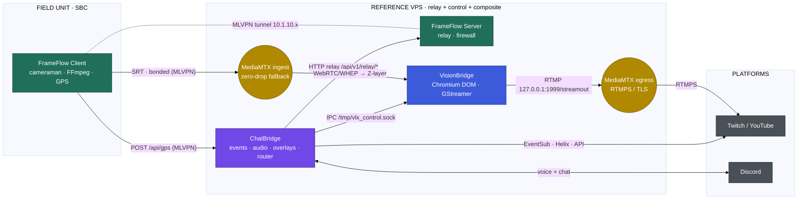

# VLX FrameFlow

> **Part of the [VLX Stream Flow](#the-vlx-stream-flow-ecosystem) ecosystem — the Edge Acquisition & Transport tier.**
> SBC-based high-availability bonding router, multi-camera SRT encoder, and GPS/telemetry source, paired with a lightweight VPS relay node.

VLX FrameFlow is a modular Go suite that turns Debian-based **Single Board Computers (SBCs)** and VPS instances into:

- **High-availability bonding routers** (dual-protocol: MLVPN for UDP, MPTCP + Shadowsocks for TCP).
- **Multi-camera streaming encoders** (V4L2/FFmpeg → SRT).
- **Real-time GPS / telemetry trackers.**

For the full system design, see **[ARCHITECTURE.md](ARCHITECTURE.md)**.

---

## The VLX Stream Flow ecosystem

VLX FrameFlow is one of three cooperating services in the **VLX Stream Flow** ecosystem — an end-to-end, self-hosted stack for IRL and studio broadcasting that runs from the field camera all the way to the streaming platform.

| Project | Tier | Responsibility | |
| :--- | :--- | :--- | :--- |
| **[VLX FrameFlow](https://github.com/viruslox/VLX_FrameFlow)** | Edge & Transport | Bonded uplink (MLVPN + MPTCP), SBC multi-camera SRT encode, GPS telemetry, VPS relay | **← this repository** |
| **[VLX VisionBridge](https://github.com/viruslox/VLX_VisionBridge)** | Composition | Headless Chromium-DOM scene compositor + GStreamer capture → MediaMTX restream | |
| **[VLX ChatBridge](https://github.com/viruslox/VLX_ChatBridge)** | Control & Engagement | Twitch/YouTube events, Discord audio gateway, overlays, and the ecosystem command router | |



**FrameFlow's role in the ecosystem:** FrameFlow originates the live A/V feed and the telemetry stream. Its SBC client encodes cameras to SRT and pushes them over a bonded MLVPN tunnel to the FrameFlow Server's MediaMTX, where VisionBridge picks them up as a composition layer. In parallel, FrameFlow's GPS module POSTs telemetry to ChatBridge, and ChatBridge issues remote-control commands back to the SBC through FrameFlow's Server-side HTTP relay. The canonical inter-service contracts (ports, relay endpoints, GPS payload) are specified in **[ARCHITECTURE.md → VLX Stream Flow contracts](ARCHITECTURE.md#vlx-stream-flow-contracts)**.

---

## Architecture at a glance

The suite compiles into a **multi-binary ecosystem** with strict role separation. Process control is handled via **`systemd`**.

| Component | Description |
| :--- | :--- |
| **`VLX_FrameFlow`** | Client binary — SBC tasks (FFmpeg, Access Point, storage, local API). |
| **`VLX_FrameFlow_SRV`** | Server binary — VPS tasks (relay node, firewall, command forwarding). |
| **`vlx_frontend`** | Remote-capable standalone UI server (embedded Svelte SPA). |
| **`config/`** | Configuration templates and maintenance scripts. |
| **`internal/`** | Core logic (network, cameraman, telemetry, security, sysutils, api). |

### Execution privilege & systemd model

FrameFlow enforces a strict operational dichotomy based on the deployed role (`FRAMEFLOW_ROLE`):

- **CLIENT (SBC / Field Unit)** — Runs strictly as an unprivileged user (default `frameflow`). Uses **user-space systemd** (`systemctl --user`, unit files in `~/.config/systemd/user/`, `default.target`). Systemd lingering must be enabled by root at install time. All client CLI modules refuse to run as root.
- **SERVER (VPS / Relay Node)** — Requires **root** (UID 0) to manage routing and firewall rules. Uses **system-space systemd** (`/etc/systemd/system/`, `multi-user.target`) with privilege dropping (`User=`, `Group=`) inside unit templates for exposed services like MediaMTX.

### Bonding

FrameFlow uses a **dual-protocol bonding architecture**: UDP (SRT video) is aggregated over **MLVPN**; TCP (telemetry/API/internet) is aggregated with **MPTCP** using `shadowsocks-libev` + `v2ray-plugin` as a transparent proxy. `SHADOWSOCKS_SERVER_IPS` supports dual-stack (comma-separated IPv4/IPv6) for concurrent tunnels.

### API & Frontend

The backend API is built on **Gin** (`github.com/gin-gonic/gin`) and serves a REST surface under `/api/…` (status endpoints accept both `GET` and `POST`). The **Control Panel Frontend** is a compiled **Svelte** SPA embedded via `//go:embed`; it polls the backend with parallel REST calls (`Promise.all`), renders semantic systemd states, and streams colorized consoles via `ansi-to-html`.

---

## Installation

FrameFlow enforces a **"Build as User, Run as Root"** workflow.

### Prerequisites

- A fresh **Debian-based OS** (e.g. Armbian on the SBC, Debian on the VPS).

### Step 1 — Clone and build (as a normal user)

```bash
mkdir -p ~/Project && cd ~/Project
git clone https://github.com/viruslox/VLX_FrameFlow.git
cd VLX_FrameFlow
./build.sh
```

### Step 2 — System configuration (as root)

Execute the role-specific binary as root to begin configuration. Regardless of role, the generated target configuration file in `/opt/VLX_FrameFlow/etc/` is universally named `frameflow.settings`.

**SBC / Field Unit (Client):**
```bash
./build/VLX_FrameFlow_amd64      # or ..._arm64 for ARM devices
```

**VPS / Relay Node (Server):**
```bash
./build/VLX_FrameFlow_SRV_amd64  # or ..._arm64 for ARM devices
```

Running a binary with no arguments launches an interactive menu (role selection / update). The **CLIENT** menu covers OS-on-storage cloning, full system configuration, network reconfiguration, and client component (MLVPN + Shadowsocks) setup. The **SERVER** menu covers server component setup and clean rollback.

---

## Runtime commands

All runtime modules run as the dedicated service user (default `frameflow`) via `systemd-run --user`.

```bash
./vlx_frameflow <command>
```

| Command | Description |
| :--- | :--- |
| `server start` \| `status` \| `stop` | Manage server components. |
| `server api start` \| `status` \| `stop` | Manage the local API relay that forwards commands to the remote Client via MLVPN. |
| `client start` \| `status` \| `stop` \| `reset` | Manage / reset client networking and bonding. |
| `bonding` | Show MPTCP proxy and MLVPN tunnel status. |
| `AP start` \| `stop` \| `status` | Control the Wi-Fi Access Point (hotspot). |
| `cameraman <VxAy> <start\|stop\|status>` | Manage a V4L2/FFmpeg → SRT encoding pipeline. |
| `mediamtx <start\|stop\|status>` | Manage the local MediaMTX service. |
| `gps <start\|stop\|status>` | Manage GPS/telemetry (gpsd + JSON push). |

### Cameraman

```bash
./vlx_frameflow cameraman <VxAy> <start|stop|status>
```

Captures video/audio dynamically via `v4l2-ctl` and `arecord`, then streams over SRT (redirecting UDP to the server tunnel via MLVPN). `VxAy` selects the video index (`x`) and audio index (`y`), e.g. `V0A1`, or `V1A0` for no audio.

### GPS Tracker

```bash
./vlx_frameflow gps <start|stop|status>
```

Controls `gpsd`, auto-detects USB/serial GPS hardware, reads TPV data via `gpspipe`, and POSTs JSON telemetry to `gps_target_url`. In the VLX Stream Flow topology this endpoint is **ChatBridge's** `POST /api/gps` receiver (see the [GPS telemetry contract](ARCHITECTURE.md#3-gps-telemetry-contract-frameflow--chatbridge)).

---

## API Command Relay (Server ↔ Client)

The **Server** acts as a transparent reverse proxy, relaying local API requests to the remote **Client (SBC)** over the MLVPN tunnel. This lets companion apps — notably **VLX ChatBridge** — control the SBC securely.

**Flow:** `ChatBridge → FrameFlow Server relay (127.0.0.1:9090) → MLVPN → FrameFlow Client API (10.1.10.2:9090)`

```bash
# Start the SBC cameraman through the relay (correct ecosystem call):
curl -X POST http://127.0.0.1:9090/api/v1/relay/cameraman/start \
  -H "Content-Type: application/json" \
  -d '{"device": "V0A1"}'

# Check the SBC MediaMTX status through the relay:
curl http://127.0.0.1:9090/api/v1/relay/mediamtx/status
```

> **Port note:** the relay binds `127.0.0.1:9090` (backend API). Port `8080` is the **frontend UI**, *not* the API — targeting `http://127.0.0.1:8080/api/…` returns 404. ChatBridge webhooks must target the relay on `9090` (see [ARCHITECTURE.md → contract #2](ARCHITECTURE.md#2-command-webhook-contract-chatbridge--frameflow)).

---

## Configuration — `/opt/VLX_FrameFlow/etc/frameflow.settings`

This shell-sourced `KEY="value"` file holds all runtime environment variables (generated during setup). Because services source it at runtime, editing the file and restarting the relevant service applies changes.

### Network & Security (selected)

| Variable | Description |
| :--- | :--- |
| `FRAMEFLOW_ROLE` | Role scoping (`SERVER`, or empty for Client). |
| `FRAMEFLOW_USER` | Dedicated unprivileged service user (default `frameflow`). |
| `MLVPN_SERVER_IP` / `MLVPN_KEY` / `MLVPN_SLOT` | MLVPN endpoint, key, and deterministic slot identity. |
| `SHADOWSOCKS_SERVER_IPS` | Server IP(s) for Shadowsocks/MPTCP bonding (dual-stack supported). |
| `bind_address` / `bind_port` | Backend API bind (default `127.0.0.1:9090`). |
| `relay_client_host` / `relay_client_port` | Remote Client API via MLVPN (default `10.1.10.2:9090`). |
| `use_relay` | Frontend flag: route UI commands through the relay (`true`) or the local Client API (`false`). |
| `DB_DSN` | SQLite DSN for cameraman config (default `/opt/VLX_FrameFlow/var/frameflow.db`). |
| `CAM_PATH_PREFIX` | Remote MediaMTX path prefix (default `cameraman`). |
| `GPSPORT` / `gps_target_url` | gpsd local port (default `1198`) and remote telemetry endpoint. |
| `SRT_URL` | Base SRT URL for bonded ingest; strictly validated before use. |

### Streaming endpoints

`SRT_URL` undergoes **strict URL validation** before it is bound to the ingest pipeline — a malformed URL cleanly aborts the FFmpeg unit with a descriptive log error.

```text
srt://10.1.10.1:8890?streamid=publish:stream_name:user:pass
```

### `/opt/VLX_FrameFlow/etc/peers.yaml` (Server only)

Multi-client MLVPN uses a deterministic slot model: each client's integer `slot` derives its interface (`mlvpn{slot}`), UDP port (`5080+slot`), and subnet (`10.1.{10+slot}.x`). Peer names must be lowercase and DNS-label safe.

```yaml
peers:
  - name: client01
    slot: 1
    key: "YOUR-SECRET-KEY-1"
```

### Apache reverse proxy (Frontend)

```apache
# ===== FrameFlow peer  (frontend :<port> — telemetry WS at /ws) =====
RedirectMatch ^/frameflow$     /frameflow/
ProxyPass        /frameflow/ws  ws://127.0.0.1:<port>/ws
ProxyPass        /frameflow/    http://127.0.0.1:<port>/
ProxyPassReverse /frameflow/    http://127.0.0.1:<port>/
```

Per-peer GUIs live at `http(s)://<apache>:<port>/frameflow/peer/`. Adjust `<port>` (default `8080`) to your `vlx_frontend` bind port.

---

## Testing

```bash
go test ./...
```

Tests cover system utilities, configuration parsing, slot derivation, relay routing, and error handling.

---

## License

**GNU General Public License v3.0** — see [LICENSE](LICENSE).

---

<sub>VLX FrameFlow is part of the **VLX Stream Flow** ecosystem · [FrameFlow](https://github.com/viruslox/VLX_FrameFlow) · [VisionBridge](https://github.com/viruslox/VLX_VisionBridge) · [ChatBridge](https://github.com/viruslox/VLX_ChatBridge)</sub>
